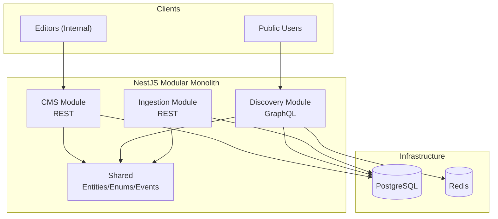

<div align="center">

# 🎙️ منصة ثمانية للمحتوى

<p>
  <a href="README.md"></a>
  <a href="README.ar.md"></a>
</p>

**منظومة برمجية متكاملة مبنية على NestJS تتألف من ثلاث وحدات رئيسية**

<p>
  
  
  
  
  
  
</p>

</div>

---

> [!NOTE]
> طُور هذا المشروع استجابة للتحدي التقني الخاص بـ **ثمانية (Senior Software Engineer Assignment - Backend)**.

يحتوي هذا المشروع على ثلاث وحدات:
- **نظام إدارة المحتوى (CMS - REST):** يُمكّن المحررين من إدارة البرامج والحلقات (العمليات الأساسية CRUD + النشر/الأرشفة).
- **نظام الاستكشاف (Discovery - GraphQL):** يتيح للجمهور تصفح المحتوى والبحث المتقدم (للمحتوى المنشور فقط) مدعوماً بتقنية التخزين المؤقت **Redis** لضمان الأداء العالي.
- **نظام التوريد (Ingestion - REST):** لإثبات قابلية التوسع مستقبلاً في استيراد البيانات (بناءً على نمط Strategy Pattern ومحاكاة الاستيراد من YouTube).

## 🔗 روابط سريعة

- تفاصيل التكليف: [`.github/software_engineer_assignment_english.md`](.github/software_engineer_assignment_english.md)
- وثيقة التصميم (العمارة البرمجية، المقايضات، المخططات البيانية): [`docs/design.md`](docs/design.md)
- ملفات Postman: [`postman/collections/Thmanyah Content Platform API.postman_collection.json`](postman/collections/Thmanyah%20Content%20Platform%20API.postman_collection.json)

## 🌐 نقاط الاتصال (Endpoints)

بعد التشغيل محلياً:

- بادئة واجهة برمجة التطبيقات (Base API prefix): `http://localhost:3000/api`
- توثيق Swagger (OpenAPI): `http://localhost:3000/docs`
- واجهة Discovery GraphQL: `http://localhost:3000/graphql`

## ✅ المتطلبات → التنفيذ

### 1) نظام إدارة المحتوى (CMS)

يستطيع المحررون:

- إنشاء/تحديث/عرض/حذف **البرامج (Programs)** (سلاسل بودكاست / سلاسل وثائقية).
- إنشاء/تحديث/عرض/حذف **المحتويات (Contents)** (حلقات / فيديوهات).
- إدارة البيانات الوصفية: `title`، `description`، `category`، `language`، بالإضافة إلى حقل `metadata` JSON قابل للتوسع.
- التحكم في دورة حياة المحتوى:
  - `POST /api/cms/contents/:id/publish`
  - `POST /api/cms/contents/:id/archive`

### 2) نظام الاستكشاف (Discovery System)

يستطيع الجمهور:

- تصفح البرامج والمحتوى المنشور عبر **GraphQL**.
- البحث في البرامج/المحتوى (المنشور فقط) مع خصائص التصفية (Filtering) والفرز (Sorting).
- الاستفادة من سرعة الاستجابة بفضل التخزين المؤقت عبر **Redis** للاستعلامات الشائعة.

### قابلية التوسع في الاستيراد (Future Import Extensibility)

لإثبات القدرة على الاستيراد من مصادر متعددة:

- تكشف **وحدة التوريد (Ingestion Module)** عن نقاط اتصال REST وتستخدم **نمط الاستراتيجية (Strategy Pattern)** (`src/ingestion/strategies/*`).
- تم توفير مستورد تجريبي لـ YouTube كمثال على التكيف (Adapter).

## 🏗️ البنية المعمارية

يتبنى المشروع منهجية **Modular Monolith** مع الالتزام بمبادئ **العمارة النظيفة (Clean Architecture)**:

- **الوحدات البرمجية (Modules):** مستقلة بذاتها (تمتلك المنافذ/المحولات الخاصة بها).
- **الطبقة المشتركة (Shared Layer):** تحتوي فقط على العناصر المتقاطعة (Cross-cutting types) مثل الكيانات (Entities)، التعدادات (Enums)، الأحداث (Events)، وتخطيطات ORM.



للاطلاع على تفاصيل التصميم الكاملة (مبادئ SOLID، حدود الوحدات، استراتيجية التخزين المؤقت، بحث Postgres النصي، والمقايضات التقنية)، راجع [`docs/design.md`](docs/design.md).

## 💻 التقنيات المستخدمة

- **بيئة التشغيل:** Node.js + TypeScript
- **إطار العمل:** NestJS
- **قواعد البيانات:** PostgreSQL (TypeORM)
- **التخزين المؤقت:** Redis
- **واجهات برمجة التطبيقات:** REST (CMS + Ingestion) + GraphQL (Discovery)
- **التوثيق:** Swagger على المسار `/docs`

## 📊 نموذج البيانات

الكيانات الجوهرية:

- `Program` (سلسلة)
- `Content` (حلقة/فيديو)، يمكن ربطه ببرنامج اختيارياً (`programId` nullable).

ملاحظات تصميمية:

- يتم تخزين البيانات الوصفية القابلة للتوسع بصيغة JSON (`metadata`).
- يتم تنفيذ بحث الاستكشاف باستخدام **PostgreSQL full-text search** (راجع `docs/design.md`).

## 📡 واجهات برمجة التطبيقات (APIs)

### CMS (REST)

المسار الأساسي: `http://localhost:3000/api/cms`

**البرامج (Programs)**

| الطريقة | نقطة الاتصال | ملاحظات |
| --- | --- | --- |
| POST | `/programs` | إنشاء برنامج |
| GET | `/programs` | عرض القائمة (pagination/filter) |
| GET | `/programs/:id` | عرض حسب المعرف |
| GET | `/programs/:id/with-contents` | البرنامج + ملخص المحتويات |
| PUT | `/programs/:id` | تحديث |
| DELETE | `/programs/:id` | حذف |

**المحتويات (Contents)**

| الطريقة | نقطة الاتصال | ملاحظات |
| --- | --- | --- |
| POST | `/contents` | إنشاء محتوى |
| GET | `/contents` | عرض القائمة (pagination/filter) |
| GET | `/contents/:id` | عرض حسب المعرف |
| PUT | `/contents/:id` | تحديث (شامل الحالة) |
| DELETE | `/contents/:id` | حذف |
| POST | `/contents/:id/publish` | نشر |
| POST | `/contents/:id/archive` | أرشفة |

مثال (إنشاء برنامج):

```bash
curl -X POST http://localhost:3000/api/cms/programs \
  -H 'Content-Type: application/json' \
  -d '{
    "title": "Fnjan",
    "description": "Conversations about culture and society",
    "type": "podcast_series",
    "category": "society",
    "language": "ar",
    "metadata": {"host": "عبدالرحمن أبومالح"}
  }'
```

مثال (إنشاء محتوى):

```bash
curl -X POST http://localhost:3000/api/cms/contents \
  -H 'Content-Type: application/json' \
  -d '{
    "programId": "<program-uuid>",
    "title": "Episode 1",
    "description": "Intro",
    "type": "podcast_episode",
    "category": "society",
    "language": "ar",
    "source": "manual",
    "metadata": {"duration": 3600}
  }'
```

### التوريد (Ingestion - REST)

المسار الأساسي: `http://localhost:3000/api/cms/ingestion`

| الطريقة | نقطة الاتصال | ملاحظات |
| --- | --- | --- |
| GET | `/sources` | عرض المصادر المتاحة |
| POST | `/import` | بدء عملية الاستيراد |

مثال (استيراد تجريبي من YouTube):

```bash
curl -X POST http://localhost:3000/api/cms/ingestion/import \
  -H 'Content-Type: application/json' \
  -d '{
    "source": "youtube",
    "channelId": "demo",
    "programId": "<optional-program-uuid>",
    "contentType": "podcast_episode",
    "category": "entertainment",
    "maxResults": 5
  }'
```

### الاستكشاف (Discovery - GraphQL)

نقطة الاتصال: `http://localhost:3000/graphql`

ملف المخطط (Schema): [`src/discovery/schema.gql`](src/discovery/schema.gql)

مثال استعلام (بحث):

```graphql
query Search($input: SearchInput!) {
  search(input: $input) {
    total
    items {
      score
      program {
        id
        title
        type
        category
      }
      content {
        id
        title
        type
        category
        programId
      }
    }
  }
}
```

المتغيرات (Variables):

```json
{
  "input": {
    "query": "فنجان",
    "categories": ["SOCIETY"],
    "limit": 10,
    "offset": 0,
    "sortBy": "RELEVANCE",
    "sortOrder": "DESC"
  }
}
```

## 🚀 التشغيل محلياً

### المتطلبات المسبقة

- Node.js + npm
- Docker (لتشغيل Postgres + Redis)

### خطوات التشغيل

```bash
cp .env.example .env
npm install

# تشغيل النظام عبر Make (التطبيق + Postgres + Redis)
make up & make dev
# التطبيق متاح عبر http://localhost:3000

# بدلاً من ذلك: تشغيل عبر Docker
docker compose up -d postgres redis
npm run start:dev
```

ملاحظات:

- يستخدم التطبيق بادئة عامة `/api`.
- توثيق Swagger متاح في `/docs`.
- في بيئة التطوير `NODE_ENV=development`، يمكن لـ TypeORM تشغيل عمليات الترحيل عبر `npm run migration:run`.

## 🌱 البيانات الأولية (Seeding)

تعمل خدمة `SeederService` تلقائياً عند بدء تشغيل التطبيق وتقوم بضخ البيانات فقط إذا كانت قاعدة البيانات فارغة (تنفذ الواجهة `OnApplicationBootstrap`).

## 🧪 الاختبارات (Testing)

```bash
npm test
npm run test:e2e
```

## 🗃️ ترحيل قواعد البيانات (Migrations)

- توليد ترحيل جديد: `npm run migration:generate -- src/migrations/<name>`
- تنفيذ الترحيلات (محلياً أو داخل حاوية Docker): `npm run migration:run`
- الترحيل الأولي (`src/migrations/1710000000000-initial-schema.ts`) يقوم بإنشاء الجداول، التعدادات، وفهارس البحث النصي (`tsvector` + GIN) لكل من البرامج والمحتوى.

## ⚖️ التحديات / المقايضات / التحسينات

- **بحث Postgres FTS مقابل Elasticsearch:** تم الاكتفاء بالبحث النصي في Postgres للحفاظ على بساطة البنية التحتية؛ مع إمكانية الترقية إلى Elasticsearch/OpenSearch عند الحاجة لتعزيز دقة النتائج والتوسع.
- **الأحداث الداخلية (In-process Events) مقابل وسيط الرسائل (Broker):** الخيار الأبسط لنمط الـ Monolith؛ يمكن تطويره لاستخدام NATS/Kafka للمعالجة غير المتزامنة والتواصل بين الخدمات.
- **إبطال ذاكرة التخزين المؤقت (Cache Invalidation):** الاعتماد على الإبطال المبني على الأحداث + TTL هو حل بسيط ولكنه eventually consistent؛ يمكن تطويره باستخدام مفاتيح ذات إصدارات (versioned keys) أو استراتيجية write-through.
- **جوانب غير مغطاة (مقصودة):** المصادقة (Auth)، تحديد معدل الطلبات (Rate-limits)، سجلات التدقيق (Audit logs)، وصلاحيات المحررين متعددي المستويات.

## ⚠️ قيود معروفة

- لا يوجد نظام لإدارة المستخدمين/المصادقة.
- مستورد تجريبي (Mock Importer) ولا يوجد تكامل فعلي مع YouTube API.
- لا يوجد تحديد لمعدل الطلبات (Rate Limiting) على واجهة GraphQL العامة.

---

إذا كنت تراجع هذا كجزء من تسليم التكليف، فإن تفاصيل العمارة البرمجية، التبريرات التقنية، والمخططات موجودة في [`docs/design.md`](docs/design.md).
