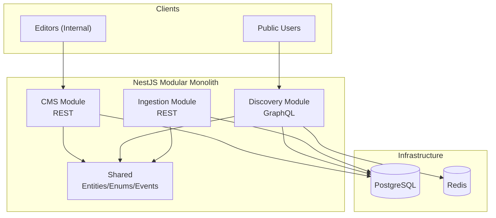

<div align="center">

# 🎙️ Thmanyah Content Platform

<p>
  <a href="README.md"></a>
  <a href="README.ar.md"></a>
</p>

**A NestJS modular-monolith implementing a three-module system**

<p>
  
  
  
  
  
  
</p>

</div>

---

> [!NOTE]
> This project was developed as a response to **Thmanyah's Senior Software Engineer Assignment (Backend)**.

This project contains three modules : 
- **CMS (REST)** for editors to manage programs and episodes (CRUD + publish/archive)
- **Discovery (GraphQL)** for public browsing and full-text search (published-only) with **Redis caching**
- **Ingestion (REST)** to demonstrate future import extensibility (strategy-based, mock YouTube)

## 🔗 Quick Links
- Assignment brief: [`.github/software_engineer_assignment_english.md`](.github/software_engineer_assignment_english.md)
- Design doc (architecture, trade-offs, diagrams): [`docs/design.md`](docs/design.md)
- Postman collection: [`postman/collections/Thmanyah Content Platform API.postman_collection.json`](postman/collections/Thmanyah%20Content%20Platform%20API.postman_collection.json)

## 🌐 Endpoints

After running locally:

- Base API prefix: `http://localhost:3000/api`
- Swagger (OpenAPI): `http://localhost:3000/docs`
- Discovery GraphQL: `http://localhost:3000/graphql`

## ✅ Requirements → Implementation

### 1) Content Management System (CMS)

Editors can:

- Create/update/list/delete **Programs** (podcast series / documentary series)
- Create/update/list/delete **Contents** (episodes / videos)
- Manage metadata: `title`, `description`, `category`, `language`, plus extensible `metadata` JSON
- Control lifecycle:
  - `POST /api/cms/contents/:id/publish`
  - `POST /api/cms/contents/:id/archive`

### 2) Discovery System

Public users can:

- Browse published programs and content via GraphQL
- Search across programs/content (published-only) with filtering and sorting
- Benefit from Redis caching on hot queries and item lookups

### Future import extensibility

To demonstrate import from multiple sources:

- The **Ingestion module** exposes REST endpoints and uses a **strategy pattern** (`src/ingestion/strategies/*`)
- A mock YouTube importer is provided as an example adapter

## 🏗️ Architecture

This project follows a **modular monolith** approach with **clean architecture principles**:

- Modules are self-contained (own their ports/adapters)
- Shared layer contains only cross-cutting types (entities/enums/events/ORM mappings)



For full design rationale (SOLID, module boundaries, caching strategy, Postgres full-text search, trade-offs), see [`docs/design.md`](docs/design.md).

## 💻 Tech Stack

- **Runtime:** Node.js + TypeScript
- **Framework:** NestJS
- **Database:** PostgreSQL (TypeORM)
- **Caching:** Redis
- **APIs:** REST (CMS + Ingestion) + GraphQL (Discovery)
- **Docs:** Swagger at `/docs`

## 📊 Data Model

Core entities:

- `Program` (series)
- `Content` (episode/video), optionally linked to a program (`programId` nullable)

Design notes:

- Extensible metadata is stored as JSON (`metadata`)
- Discovery search is implemented using PostgreSQL full-text search (see `docs/design.md`)

## 📡 APIs

### CMS (REST)

Base: `http://localhost:3000/api/cms`

**Programs**

| Method | Endpoint                      | Notes                      |
| ------ | ----------------------------- | -------------------------- |
| POST   | `/programs`                   | Create program             |
| GET    | `/programs`                   | List (pagination/filter)   |
| GET    | `/programs/:id`               | Get by id                  |
| GET    | `/programs/:id/with-contents` | Program + contents summary |
| PUT    | `/programs/:id`               | Update                     |
| DELETE | `/programs/:id`               | Delete                     |

**Contents**

| Method | Endpoint                | Notes                    |
| ------ | ----------------------- | ------------------------ |
| POST   | `/contents`             | Create content           |
| GET    | `/contents`             | List (pagination/filter) |
| GET    | `/contents/:id`         | Get by id                |
| PUT    | `/contents/:id`         | Update (incl. status)    |
| DELETE | `/contents/:id`         | Delete                   |
| POST   | `/contents/:id/publish` | Publish                  |
| POST   | `/contents/:id/archive` | Archive                  |

Example (create program):

```bash
curl -X POST http://localhost:3000/api/cms/programs \
  -H 'Content-Type: application/json' \
  -d '{
    "title": "Fnjan",
    "description": "Conversations about culture and society",
    "type": "podcast_series",
    "category": "society",
    "language": "ar",
    "metadata": {"host": "عبدالرحمن أبومالح"}
  }'
```

Example (create content):

```bash
curl -X POST http://localhost:3000/api/cms/contents \
  -H 'Content-Type: application/json' \
  -d '{
    "programId": "<program-uuid>",
    "title": "Episode 1",
    "description": "Intro",
    "type": "podcast_episode",
    "category": "society",
    "language": "ar",
    "source": "manual",
    "metadata": {"duration": 3600}
  }'
```

### Ingestion (REST)

Base: `http://localhost:3000/api/cms/ingestion`

| Method | Endpoint   | Notes                  |
| ------ | ---------- | ---------------------- |
| GET    | `/sources` | List available sources |
| POST   | `/import`  | Trigger import         |

Example (import mock YouTube):

```bash
curl -X POST http://localhost:3000/api/cms/ingestion/import \
  -H 'Content-Type: application/json' \
  -d '{
    "source": "youtube",
    "channelId": "demo",
    "programId": "<optional-program-uuid>",
    "contentType": "podcast_episode",
    "category": "entertainment",
    "maxResults": 5
  }'
```

### Discovery (GraphQL)

Endpoint: `http://localhost:3000/graphql`

Schema file: [`src/discovery/schema.gql`](src/discovery/schema.gql)

Example query (search):

```graphql
query Search($input: SearchInput!) {
  search(input: $input) {
    total
    items {
      score
      program {
        id
        title
        type
        category
      }
      content {
        id
        title
        type
        category
        programId
      }
    }
  }
}
```

Variables:

```json
{
  "input": {
    "query": "فنجان",
    "categories": ["SOCIETY"],
    "limit": 10,
    "offset": 0,
    "sortBy": "RELEVANCE",
    "sortOrder": "DESC"
  }
}
```

## 🚀 Running Locally

### Prerequisites

- Node.js + npm
- Docker (for Postgres + Redis)

### Steps

```bash
cp .env.example .env
npm install

# Start via Make (app + Postgres + Redis)
make up & make dev
# App is available at http://localhost:3000

# Alternatively: start using docker
docker compose up -d postgres redis
npm run start:dev
```

Notes:

- The app uses a global `/api` prefix.
- Swagger is available at `/docs`.
- In `NODE_ENV=development`, TypeORM can run migrations via `npm run migration:run` (see **Database migrations**).

## 🌱 Seed / Demo Data

A seeder runs automatically on application bootstrap and seeds only if the database is empty (`SeederService` implements `OnApplicationBootstrap`).

## 🧪 Testing

```bash
npm test
npm run test:e2e
```

## 🗃️ Database Migrations

- Generate new migration: `npm run migration:generate -- src/migrations/<name>`
- Run migrations (locally or inside the Docker container): `npm run migration:run`
- Initial migration (`src/migrations/1710000000000-initial-schema.ts`) creates tables, enums, and full-text-search indexes (`tsvector` + GIN) for both `programs` and `content`.

## ⚖️ Challenges / Trade-offs / Improvements

- **Postgres FTS vs Elasticsearch:** kept infra minimal for the assignment; can be swapped for Elasticsearch/OpenSearch when relevance and scale require it.
- **In-process events (EventEmitter) vs a broker:** simplest for a modular monolith; can evolve to NATS/Kafka for async workloads and cross-service communication.
- **Cache invalidation:** event-driven invalidation + TTL is simple but eventually consistent; can evolve with versioned keys or write-through caching.
- **Missing concerns (intentional for scope):** auth, rate-limits, audit logs, multi-tenant editorial permissions.

## ⚠️ Known Limitations

- No user management/authentication
- Mock importer (no real YouTube API integration)
- No rate limiting on the public GraphQL API

---

If you’re reviewing this as an assignment submission, the detailed architecture, reasoning, and diagrams are in [`docs/design.md`](docs/design.md).
